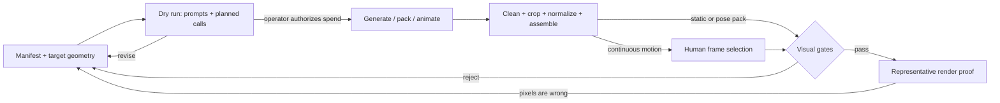

# Sprite Generator’s executable loop

The machine-readable source is [`loop.manifest.json`](../loop.manifest.json).

## Authority boundary

Models produce raw candidates. They do not authorize provider spending, choose
the final moments from an animation, install files into a game, or declare a
render accepted.

The `animate` workflow stops after extraction so a person can inspect the
contact sheet. This is an intentional interrupt, not a missing automation.

## Gates proven able to fail

| Gate | Known-good path | Known-bad fixture |
| --- | --- | --- |
| Background cleanup | Connected provider background becomes transparent while the subject remains | An opaque border-connected field is removed in the synthetic fixture |
| Identity + drift | Identical frames pass | A deliberately displaced frame fails |
| Pack geometry | Synthetic poses become the exact declared sheet dimensions | A missing raw is reported as failure |
| Cost boundary | Dry run resolves prompts locally | Provider invocation stops without the required credential |

`npm run preflight` runs the deterministic cases and installs the packed npm
tarball into a blank project. No test calls an image or video provider.
