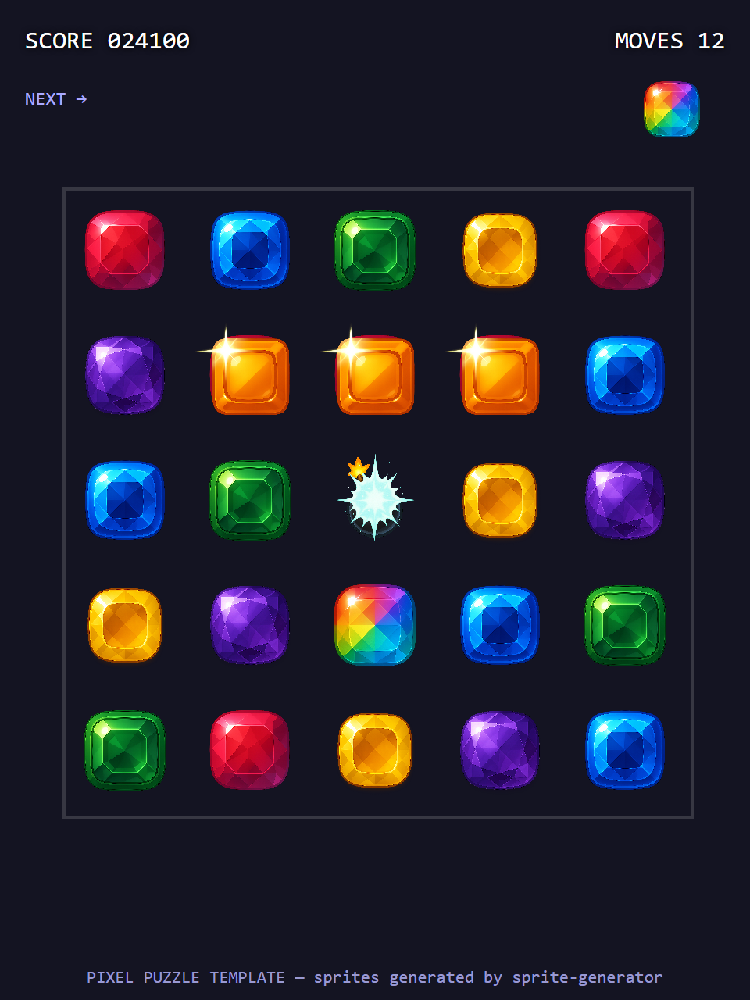

# Pixel Puzzle Template

> Match-3 puzzle. 10 assets — 5 colored gems, bomb + rainbow specials, sparkle + clear-burst effects, tileable board cell.



## Use this template

```bash
npx sprite-generator init --template pixel-puzzle
OPENAI_API_KEY=sk-... npx sprite-generator
node node_modules/sprite-generator/templates/pixel-puzzle/capture.js
```

## What the demo verifies

| Check | Where it shows up in the frame |
|---|---|
| **Gem set cohesion** | 5 colors rendered in an identical rounded-square cut — the whole grid reads as one coherent set |
| **Highlight direction** | Every gem has its highlight on the upper-left — "same light source" is the match-3 genre's visual signature |
| **Specials distinct** | Bomb (fuse) and rainbow (iridescent) stand out as specials without breaking the overall gem silhouette |
| **Board contrast** | Board cells are low-contrast so gems pop; if gems blend into cells, the template's contrast guidance needs tuning |
| **Effect layering** | Sparkles overlay an in-progress horizontal match; clear-burst sits over a bomb cell — both effects read over busy gem grid |
| **Scale parity** | Every gem occupies the same footprint on the grid — no sprite is mysteriously smaller or larger |

## Design notes

- **Shape consistency is THE match-3 rule.** `defaultStyle` pins "rounded square" as the shared cut, and every gem description says "cut in the same rounded square shape as the ruby". Without that anchor you get one sphere, one crystal, one heart — chaos.
- **Highlight direction is the second anchor.** All highlights upper-left — consistent with the `defaultStyle` lighting. Players read uniform light direction as "these belong together" even before they notice the shapes match.
- **Board tile is deliberately low-contrast.** Described as "very low contrast so gems placed on it stand out" — a busier board cell will fight the gems for attention.
- **Want more colors?** Duplicate any gem entry, change the color words (e.g. "deep orange core transitioning to pale peach highlight"), keep everything else identical. The set will stay coherent.
