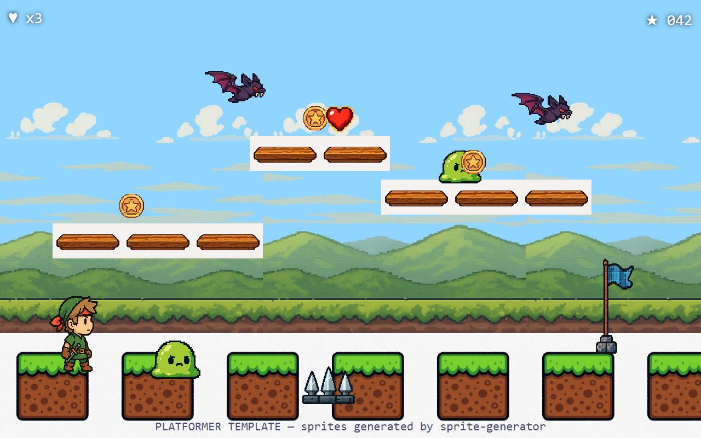

# Platformer Template

> 2D side-scrolling platformer. 10 assets — hero, 2 enemy types, 2 pickups, checkpoint flag, 2 tileable tiles, spike hazard, parallax hills background.



## Use this template

```bash
npx sprite-generator init --template platformer
OPENAI_API_KEY=sk-... npx sprite-generator
node node_modules/sprite-generator/templates/platformer/capture.js
```

## What the demo verifies

| Check | Where it shows up in the frame |
|---|---|
| **Proportions** | Hero clearly larger than slimes; bats scaled for air; coins small enough to be collectibles |
| **Tileability** | Ground row tiles edge-to-edge across the full width; parallax hills bg tiles horizontally |
| **Hero readability** | Hero on left of scene with distinguishing silhouette (green tunic, red headband) — obviously the player |
| **Hazard legibility** | Silver spikes sit on the ground row, clearly different from platforms |
| **Pickup theme** | Coin + heart share the saturated-with-outline look defined by `defaultStyle` |
| **Checkpoint prop** | Flag is full-height on right side, not blending into hills |

## Design notes

- **Lighting direction matters.** `defaultStyle` pins lighting to upper-left so shadow/highlight placement stays consistent across every sprite. Drop this constraint and sprites look like they were drawn on different days.
- **Bold outlines are the style unifier.** Every asset has the same outline weight because the style string says so — the model treats it as a render setting, not a per-sprite choice.
- **Tiles must be flagged NOT transparent.** Ground and hills are backgrounds in disguise; the generator will still try to add alpha if you don't veto it.
- **Pickups are deliberately *shape-distinct*.** Coin is flat/round, heart is heart-shaped. Don't let both become glowy cubes or the HUD reads as noise.
