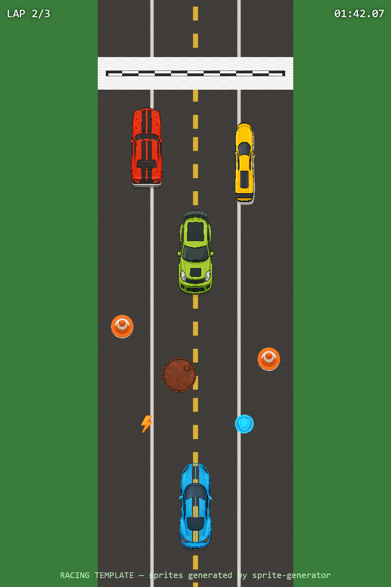

# Racing Template

> Top-down arcade racer. 11 assets — player car, 3 opponent variants, tileable straight + curve road, 2 obstacles, boost/shield pickups, finish line.



## Use this template

```bash
npx sprite-generator init --template racing
OPENAI_API_KEY=sk-... npx sprite-generator
node node_modules/sprite-generator/templates/racing/capture.js
```

## What the demo verifies

| Check | Where it shows up in the frame |
|---|---|
| **Camera consistency** | Every car, obstacle, and pickup rendered from the identical overhead angle — drift shows immediately |
| **Car proportions** | Player car is the reference scale; opponents are visibly distinct silhouettes (muscle / rally / supercar) |
| **Track tileability** | Road tiles down the center of the stage with seamless repeating dashed line and edge markers |
| **Obstacle legibility** | Cone and barrel are small, distinguishable footprints — not mistaken for cars |
| **Pickup theme** | Boost (orange bolt) and shield (blue shield) use consistent halo-over-icon pattern |
| **Finish-line tileability** | Checkered line spans the road width — tiles correctly across arbitrary road widths |

## Design notes

- **"Viewed from directly overhead (bird's-eye view, 90 degrees)" is the constraint the whole template rides on.** Without the explicit angle the model slides into 3/4 view and the scene stops composing.
- **Cars have a consistent reference frame.** Every car description says "nose pointing up" so the demo can rotate them without each sprite fighting its own internal orientation.
- **Track assets must be flagged NOT transparent.** Road, curve, and finish line are opaque by design — the demo tiles them as a solid road surface.
- **Opponent variety is silhouette-driven**, not color-driven. Muscle car is chunky, supercar is long, rally is compact. Change the colors freely but keep the shape differences.
