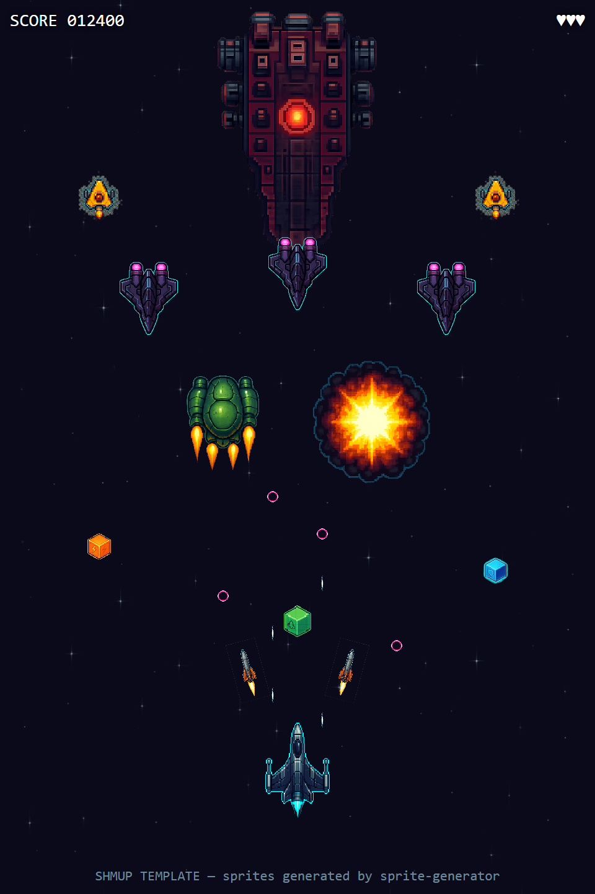

# Shmup Template

> Top-down vertical shoot-em-up. 13 assets — player ship, 3 enemy variants, boss, 3 projectile types, explosion, 3 pickups, tileable starfield.



The screenshot above is rendered from the generated sprites by `demo.html`, which arranges every asset in-scene at the proportions a real game would use. If anything looks off — wrong scale, style drift between ships, ambiguous "is that friendly or enemy" bullets — it's visible at a glance.

## Use this template

```bash
npx sprite-generator init --template shmup
OPENAI_API_KEY=sk-... npx sprite-generator
node node_modules/sprite-generator/templates/shmup/capture.js   # rebuild screenshot.png from your sprites
```

For local dev inside this repo:

```bash
node generate.js init --template shmup
OPENAI_API_KEY=sk-... node generate.js
node templates/shmup/capture.js
```

## What the demo verifies

The `demo.html` is not a playable game — it's a showcase scene engineered so a single still captures every correctness criterion:

| Check | Where it shows up in the frame |
|---|---|
| **Proportions** | Boss > bomber > fighter > scout > player, all visible in one shot |
| **Friend/foe legibility** | Player ship near bottom nose-up; enemies mid-screen nose-down; player bullets cyan, enemy bullets magenta |
| **Theme consistency** | All 13 sprites rendered side-by-side — drift between them is obvious |
| **Effects layer** | Explosion renders over an enemy mid-scene |
| **Tileable background** | Starfield scrolls visibly (captured as a still still shows the seamless tile) |
| **Pickups readable** | Three powerup cubes (weapon/shield/life) at distinguishable colors |

If any sprite is missing from `output/`, the demo draws a red dashed outline in its place and `capture.js` prints the 404 list — so a broken generation run can't quietly ship a misleading screenshot.

## Design notes

- **`defaultStyle` is the workhorse.** Every sprite inherits *"top-down vertical shoot-em-up sprite, clean retro-pixel illustration with subtle neon rim-light, transparent background, 256x256"*. Don't duplicate this in descriptions.
- **Descriptions say what makes *this* sprite unique**, including orientation (nose up vs nose down), relative scale ("smaller than the player ship"), and role-coded colors. Orientation and scale cues matter because the model has no spatial context outside the prompt.
- **Background is the one non-transparent asset.** It's explicitly flagged as *"NOT transparent"* and *"tileable"* — the renderer relies on both.
- **Projectile palette is the friend/foe key.** Player = cyan, enemy = magenta-red. Change the palette here and the demo's readability collapses — useful as a deliberate variant.
