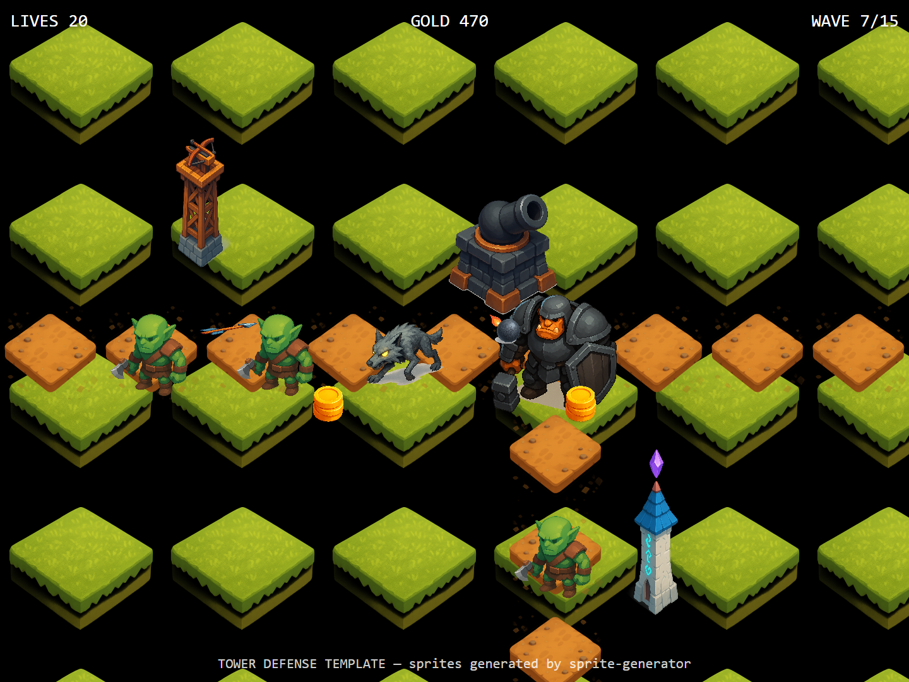

# Tower Defense Template

> Tower defense with a slight 60-degree elevation. 11 assets — 3 tower types (arrow/cannon/magic), 3 creep variants, 2 projectiles, gold coins, tileable path + grass.



## Use this template

```bash
npx sprite-generator init --template tower-defense
OPENAI_API_KEY=sk-... npx sprite-generator
node node_modules/sprite-generator/templates/tower-defense/capture.js
```

## What the demo verifies

| Check | Where it shows up in the frame |
|---|---|
| **Angle consistency** | Every asset rendered from the same 60-degree camera — towers, creeps, tiles all feel like they sit on the same ground plane |
| **Tower silhouettes** | Arrow = tall/thin, cannon = squat/heavy, magic = spire-with-crystal — distinguishable at a glance even without color |
| **Creep hierarchy** | Tank visibly dwarfs grunt which dwarfs fast creep, mirroring in-game HP/speed/threat |
| **Path tiling** | L-shaped path rendered from individual tiles, no seams at the corner cells |
| **Projectile scale** | Arrows and cannonballs sized correctly against towers and creeps (visible mid-air) |
| **Economy feedback** | Coin pickups scale to read as "drop from kill" not as tower-sized structures |

## Design notes

- **60-degree elevation is the differentiator.** Other top-down templates use pure 90-degree overhead; this one opts in to perspective so towers can have visible *height*. Stay on exactly "60 degrees" in every description — drift to 45 degrees and tall spires start tipping over.
- **Every tile description repeats the angle.** Because tiles are non-transparent surfaces the model loves to default to flat overhead texture if you don't re-pin the angle per-sprite.
- **Grass + path tile specs match tile dimensions.** The demo uses 80px cells; any tile whose generated content bleeds to the edge breaks the seamless repeat.
- **Creeps stand in place.** Descriptions say "standing in place" / "crouched in a running stance" but don't animate — walk cycles go through the `animations` manifest extension (see main README).
