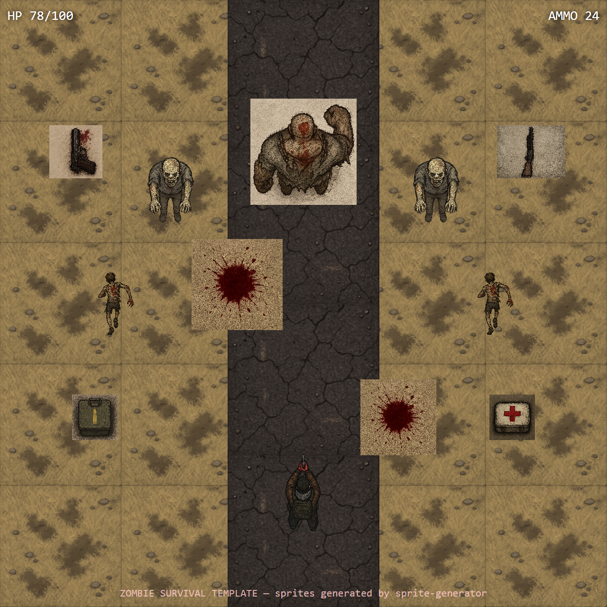

# Zombie Survival Template

> Top-down twin-stick survival. 11 assets — survivor, 3 zombie variants (walker/runner/brute), pistol, shotgun, ammo box, medkit, blood splatter, grass + road tiles.



## Use this template

```bash
npx sprite-generator init --template zombie-survival
OPENAI_API_KEY=sk-... npx sprite-generator
node node_modules/sprite-generator/templates/zombie-survival/capture.js
```

## What the demo verifies

| Check | Where it shows up in the frame |
|---|---|
| **Overhead consistency** | Every character, pickup, and decal rendered from the same bird's-eye angle |
| **Threat hierarchy** | Brute > walker > runner silhouettes readable at the scale they appear in gameplay |
| **Tone cohesion** | Muted earthy palette with blood-red accents — no sprite leaks into cartoon territory |
| **Ground layering** | Blood splatters composite underneath bodies, over grass/road tiles |
| **Tileability** | Grass covers the stage; road strip runs down the middle; both tile seamlessly |
| **Weapon legibility** | Pistol vs shotgun distinguished by length + wood stock, not just color |

## Design notes

- **Palette is the tone anchor.** `defaultStyle` pins "muted earthy palette with selective blood-red accents" — remove that and sprites drift into saturated cartoon zombies that fight the grim tone.
- **All enemies face-up with arms-forward.** Described identically so the demo can place them in any formation without per-sprite rotation correction.
- **Blood splatter is explicitly a "ground-decal"** with semi-transparent edges. This is the only sprite allowed to be messy-edged; everything else is crisp.
- **Grass + road tiles are flagged NOT transparent.** They're the stage floor; the demo would render holes if they had alpha.
- **Swap the weapon pickups to expand.** The pickup pattern (flat overhead object, barrel-up orientation) extends cleanly to rifle/smg/grenade without needing a new demo layout.
